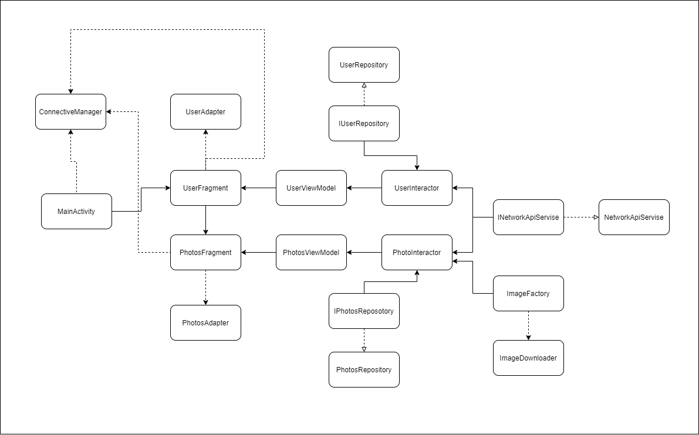

# Тестовое задание для Gora.Studio
Написать приложение, которое отображает фотографии каждого выбранного пользователя
**без использования библиотек** для https://jsonplaceholder.typicode.com.
Для экрана фотографий организовать кеширование картинок в памяти, отображать
индикатор загрузки для каждой фотографии. Каждая ячейка имеет тень и скругленные
углы. Отображать title фотографии под изображением (количество строк неограниченно).

## Как приложение работает при отсутствии интернета
* При переходе на какой-либо фрагмент проверяется отсутствие интернета, и, если интернета нет -> тулбар изменяется на соответствующий, оставляя возможность для переподключения
* Если интернет отключился во время загрузки картинок, то незагруженные картинки отображают "поломанное изображение"

## Архитектура 
 

    
 

## Пример работы приложения

